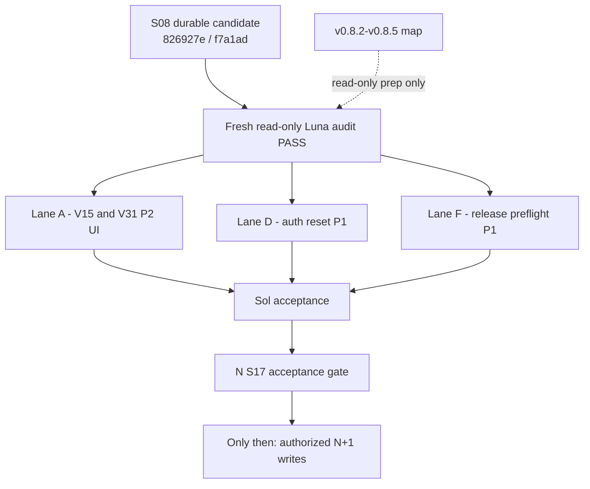

# V0.8.1 Remaining Work DAG

## Status and boundary

- **Status:** `V81-S09_REMAINING_WORK_DAG_ACCEPTED_READY_FOR_COMMIT`
- **State:** `ACCEPTED_UNCOMMITTED_READY_FOR_GOVERNANCE_COMMIT`
- **Plan acceptance:** `SOL_V81_S09_PLAN_ACCEPTANCE=PASS` at `2026-08-12T03:19:02.3863331+08:00`.
- **Lane reviews:** Lane A, Lane D, and Lane F each `PASS_NO_P0_P1_P2_P3`; aggregate `PASS_NO_P0_P1_P2_P3_ALL_THREE_LANES`.
- **Accepted plan baseline:** commit `826927e2365c2cb00613d3b43c2af6b3ee346b95`, tree `f7a1adaa008d1944c2f579653f9c321d075fb958`.
- **Current candidate state:** `OPEN_P0=0`; `OPEN_P1=2` exactly: `AUTH_RESET_CROSS_RESOURCE_ATOMICITY` and `RELEASE_PREFLIGHT_IDENTITY_ROLLBACK_EVIDENCE`. Both P1 families are intentionally unresolved until implementation.
- **Browser state:** `P0=0`; `P1=0`.
- **Current bounded P2 lanes:** `V15` candidate/version cue and `V31` off-canvas navigation inert state, `aria-hidden`, and focus return.
- **Operational boundary:** this accepted record authorizes only the exact four-path S09 governance commit/push. No canonical source edit or provider, Playground, Production, migration, or ref action may occur before governance push parity; accepted Lane A, Lane D, and Lane F implementation begins only in three isolated disjoint worker branches/worktrees after parity.

## Exact 42-item release mapping

| Release | Items                                                                                                                                                | State                                    |
| ------- | ---------------------------------------------------------------------------------------------------------------------------------------------------- | ---------------------------------------- |
| v0.8.1  | `V01,V02,V04,V06,V07,V08,V09,V12,V13,V17,V18,V20,V21,V22,V25,V32,V33,V39` (18 prior A/C), `V15,V31` (pending code), `V16,V19,V42` (pending evidence) | 23 total; current complete 18, pending 5 |
| v0.8.2  | `V10,V23,V24,V26,V27`                                                                                                                                | 5                                        |
| v0.8.3  | `V03,V29,V30,V34`                                                                                                                                    | 4                                        |
| v0.8.4  | `V14`                                                                                                                                                | 1                                        |
| v0.8.5  | `V05,V11,V28,V35,V36,V37,V38,V40,V41`                                                                                                                | 9                                        |

`COMPLETE_IN_V0.8.1=23`; `COMPLETE_IN_V0.8.2=5`; `COMPLETE_IN_V0.8.3=4`; `COMPLETE_IN_V0.8.4=1`; `COMPLETE_IN_V0.8.5=9`; `OWNER_DECISION_REQUIRED=0`; `ABANDONED=0`; `UNACCOUNTED=0`; total `42`. The current v0.8.1 state is complete `18`, pending `5`.

`V03` is a UX lifecycle item in the v0.8.3 read-only preparation lane. It is not the current `AUTH_RESET_CROSS_RESOURCE_ATOMICITY` P1 family and must not be used to broaden the current auth-reset scope.

## B evidence obligations

These obligations are pending. Source seams are read-only evidence inputs; only the current-application E2E is writable for evidence under Lane A.

- **V16 - `admin.overview` responsive evidence:** use `src/v5/src/surfaces/operations.js` and `src/v5/styles/v4.css` as read-only source/render seams, then add focused `tests/e2e/v5-current-application.spec.js` route proof at responsive widths. Prove the `admin.overview` grid and critical content render without clipping or horizontal overflow.
- **V19 - deterministic contextual-form evidence:** use `src/v5/integration/operations-parity.js` as a read-only source seam. In `tests/e2e/v5-current-application.spec.js`, deterministically prove review, info, reject, and reserve forms; selected-request lifecycle and context; mobile active mount and fallback; and that no form or fallback binds the wrong request ID.
- **V42 - sticky masthead geometry evidence:** the actual sticky rule is `src/v5/styles/v4.css:1158-1169` and remains read-only. In `tests/e2e/v5-current-application.spec.js`, capture scroll/geometry proof at `320`, `390`, `1024`, and `1280` for the initial state, `scrollIntoView`, and representative scrolling. At each point, prove masthead and hero-heading bounds do not overlap or obscure one another.
- **V41 - later design convergence:** route V41 to v0.8.5. The intended crop and visual target are ambiguous and require design convergence; V41 is not closed or implemented in the current v0.8.1 lane.

If any evidence test reproduces a defect or requires a product/CSS write outside Lane A, stop and request a bounded amendment. Do not convert a reproduced defect into an unapproved source fix.

## Dependency graph

`N+1` writes are forbidden before `N S17`. The lanes are disjoint. A Luna audit may inspect them, but it cannot change them.

## Post-Luna implementation lanes

### Lane A - V15/V31 code plus V16/V19/V42 evidence

**Allowed write paths only:** `src/v5/src/app.js`, `src/v5/integration/runtime.js`, `src/v5/styles/responsive.css`, and `tests/e2e/v5-current-application.spec.js`. V15/V31 may use the four paths within their contracts. For V16/V19/V42 evidence, only `tests/e2e/v5-current-application.spec.js` may change.

**Read-only evidence seams:** `src/v5/src/surfaces/operations.js`, `src/v5/integration/operations-parity.js`, `src/v5/styles/v4.css`, `src/v5/integration/owner-visual-feedback.css`, and `src/v5/src/surfaces/public.js` are not authorized edit paths. No operations source/parity, `v4.css`, owner CSS, or `public.js` edit is allowed.

**V15 source and verification contract:** the only source is `integration.releaseIdentity`, populated from `backend.version()` inside `verifyPlaygroundContext`. Never source release identity from `import.meta.env`, client literals, or playground status. Keep `playgroundVerified=false` unless all predicates pass: `identity.playground=true`; both identity and health report `STAGING`; health dependencies are green; `appVersion` and `releaseVersion` are valid and equal; and `candidateSha` is lowercase 40-hex. Only a verified candidate may render the sanitized cue `STAGING TEST ENV | v<releaseVersion> | SHA <first12>`. Any invalid, absent, or mismatched predicate removes the cue and blocks all Playground chrome.

**V31 responsive/focus contract:** at a frame/container width of `<=1023`, a closed rail has `inert`, `aria-hidden="true"`, and no focusable descendants. Opening removes both attributes and focuses the first visible authorized navigation item, falling back to the rail container. At `>=1024`, the rail remains interactive except for existing modal-overlay behavior. Menu-toggle, scrim, and Escape closes restore the same menu control that opened the rail. Route selection closes the rail and then allows the existing `go()`/`focusMain` route focus to win.

**Required E2E proof:** a verified STAGING fixture asserts the exact safe version and 12-character SHA prefix while proving that no full or private identity is rendered. Production and invalid fixtures assert no cue and no Playground session. Use `setViewportSize` at the exact `1023` and `1024` boundary plus `320`, `390`, and `1280`; at each applicable width prove rail attributes, focus containment, toggle/scrim/Escape close-return behavior, route-selection focus precedence, reduced-motion safety, and no horizontal overflow.

**Required B evidence E2E proof:** V16 receives focused `admin.overview` route/render proof across responsive widths, including grid and critical-content visibility with no clipping or overflow. V19 receives deterministic review/info/reject/reserve form proof, selected-request lifecycle/context proof, mobile active-mount/fallback proof, and wrong-ID exclusion. V42 receives initial, `scrollIntoView`, and representative-scroll geometry proof at `320`, `390`, `1024`, and `1280`, with masthead and hero-heading bounds never overlapping or obscuring one another.

**Invariants:** preserve existing route, authorization, payload, capability, release-match, and modal-overlay contracts. Keep the established visual system; no redraw. Browser P0/P1 remains zero.

**Stop conditions:** any release-identity fallback outside `integration.releaseIdentity`; any unsanitized/full/private identity; any Playground chrome without every verification predicate; any redraw or path outside this list; any route/contract change, focus failure, boundary failure, overflow, accessibility regression, or new browser P0/P1. If V16/V19/V42 evidence reproduces a defect or needs any product/CSS path outside the four allowed write paths, stop for a bounded amendment.

### Lane D - auth-reset cross-resource atomicity P1

**Allowed paths only:** `src/server/auth/service.js`, `src/server/auth/repository.js`, `src/server/d1/auth-repository.js`; `src/server/auth/http-handler.js` only if a safe conflict mapping is required; `tests/unit/auth-service.test.js`, `tests/unit/auth-http-handler.test.js`, and the targeted new `tests/unit/auth-reset-atomicity.test.js`.

**Schema and ownership boundary:** `NO_SCHEMA_CHANGE`. Add one atomic repository operation in `src/server/auth/repository.js` and `src/server/d1/auth-repository.js`. The service must never compose individual reset writes. Schema, UI, provider, environment, access-admin, membership mutation, and every unrelated path are excluded.

**Service and commit order:** validate the password and digest without writes, then call one repository commit that orders: (1) authoritative token guard/consume on digest, account, unconsumed state, and expiry; (2) targeted account guard/update requiring `ACTIVE`, not locked, and the expected credential version, with no generic `saveAccount` and committees untouched; (3) revoke only the target account sessions; and (4) append `PASSWORD_RESET_COMPLETED` audit inside the same commit.

**Repository atomicity:** D1 uses one `db.batch` and the existing NOT-NULL `data_revisions.updated_at`/`changes()` abort sentinel immediately after each zero-row token or account guard, so no post-batch throw can commit partial writes. The in-memory transaction snapshots and restores every account, token, session, and audit map on any error. Memberships remain unchanged.

**Safe outcome mapping:** replay and expiry return `RESET_INVALID`/401. Disabled, revoked, or locked accounts return `ACCOUNT_UNAVAILABLE`/403. A guard conflict returns `RESET_CONFLICT`/409 only if the optional HTTP-handler mapping is needed. An unexpected failure returns only a generic safe 500 plus correlation identifier; it exposes no raw token, password, account, or cause.

**Exact test matrix:** in both real Miniflare D1 and the in-memory repository, cover success; replay; expiry; disabled, revoked, and locked accounts; stale account and token conflicts; forced account, session, and audit failures; and same-token `Promise.all` with one winner and one safe loser. Every failure case proves zero writes, token reusability where appropriate, and unchanged sessions, memberships, and audit. HTTP assertions prove safe status/code/correlation output and no raw token, password, account, or cause.

**Stop conditions:** any schema need, generic account save, service-composed writes, post-batch partial-commit risk, missing per-guard abort sentinel, incomplete in-memory restore, partial cross-resource write, missing rollback/zero-write proof, membership/committee change, secret exposure, unsafe HTTP mapping, or excluded-scope change.

### Lane F - release-preflight identity and rollback evidence P1

**Allowed paths only:** `scripts/deploy-environment.mjs`, `scripts/staging-candidate-smoke.mjs`, `scripts/staging-candidate-evidence.mjs`, `scripts/production-recovery-evidence.mjs`, `scripts/staging-sandbox.mjs`, optional existing `scripts/staging-sandbox-lib.mjs`, `tests/unit/release-pipeline.test.js`, `tests/unit/staging-sandbox.test.js`, `tests/unit/staging-sandbox-lifecycle.test.js`, and `tests/staging-e2e/staging-auth-access.spec.js`.

**Identity contract:** parse authoritative `releaseVersion` from `package.json`. For a staging/recovery candidate, the current Git branch and private configuration `CANDIDATE_BRANCH` must be equal and match `^(release|fix|hotfix)/v<exact-package-version>-<slug>$`. Production deployment requires both current branch and configuration branch to be `main`. Configuration and live `APP_VERSION` must equal the package version, and candidate SHA must equal exact `HEAD`. No v0.8.1 one-off literal or provider write is allowed.

**Evidence and rollback contract:** staging evidence rejects an absent or empty Time Travel bookmark before PASS and preserves the production bookmark, backup, and restore checks. Backup proof requires the export SHA, isolated-restore `integrity_check` PASS, foreign-key violations `0`, schema `30/0030`, reconciliation `RECONCILED`, prior Worker deployment snapshot, R2/config fingerprints, and no synthetic active Production accounts.

**Exact test matrix:** accept the current v0.8.1 temporary branch. Reject a retired v0.8.0 branch, wrong version, `main` or a permanent staging branch used as a staging candidate, configuration-branch mismatch, `APP_VERSION` mismatch, candidate-SHA/HEAD mismatch, an absent or empty Time Travel bookmark, and Production on a non-main branch. Prove every required backup/restore field before evidence can pass.

**Preserved release path:** `.github/workflows/release-candidate.yml` remains Playground-only, contains no Production job, retains `WAIT FOR EARL`, and is not an allowed edit path. `scripts/playground/**` remains unchanged and is not an allowed edit path. No provider, environment, Production, or configuration write occurs without separately accepted operational authorization.

**Stop conditions:** identity supplied by a one-off literal; branch/config/package/`APP_VERSION`/HEAD mismatch; empty Time Travel bookmark; Production target other than `main`; any missing backup, restore, reconciliation, prior-deployment, or fingerprint proof; synthetic active Production account; any proposed edit to `.github/workflows/release-candidate.yml` or `scripts/playground/**`; requested provider write; or any unapproved path.

## Later-version preparation

The v0.8.2, v0.8.3, v0.8.4, and v0.8.5 mappings are read-only preparation. They authorize no code, documentation, provider, deployment, schema, or environment write. Their only permitted effect now is accurate dependency and test planning for the accepted post-governance isolated lanes.

## Acceptance and governance-commit boundary

1. Fresh Luna plan review is complete: Lane A, Lane D, and Lane F each `PASS_NO_P0_P1_P2_P3`.
2. Sol plan acceptance is `PASS`; state is `ACCEPTED_UNCOMMITTED_READY_FOR_GOVERNANCE_COMMIT`.
3. Commit and normally push only `.codex/CURRENT.md`, `.codex/CURRENT_TASK.md`, `.codex/CURRENT_HANDOFF.md`, and `.codex/releases/v0.8.1/V0_8_1_REMAINING_WORK_DAG.md`.
4. Verify local, upstream, and remote parity plus preserved46 after that governance push.
5. Only after parity, create three isolated disjoint worker branches/worktrees for accepted Lane A, Lane D, and Lane F. No canonical source edit or provider, Playground, Production, migration, or ref action is authorized before parity.

**Exact next action:** Commit and normally push only the exact four S09 governance paths, verify local/upstream/remote parity and preserved46, then create three isolated disjoint worker branches/worktrees for accepted Lane A, Lane D, and Lane F; no canonical source edit/provider/Playground/Production/migration/ref action before governance push parity.
