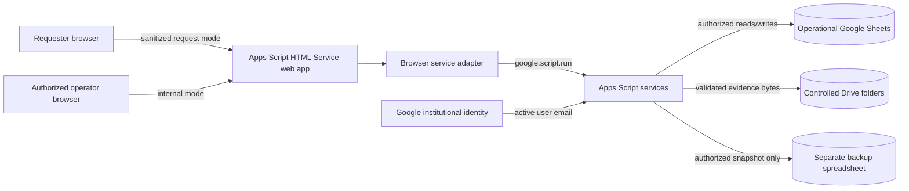
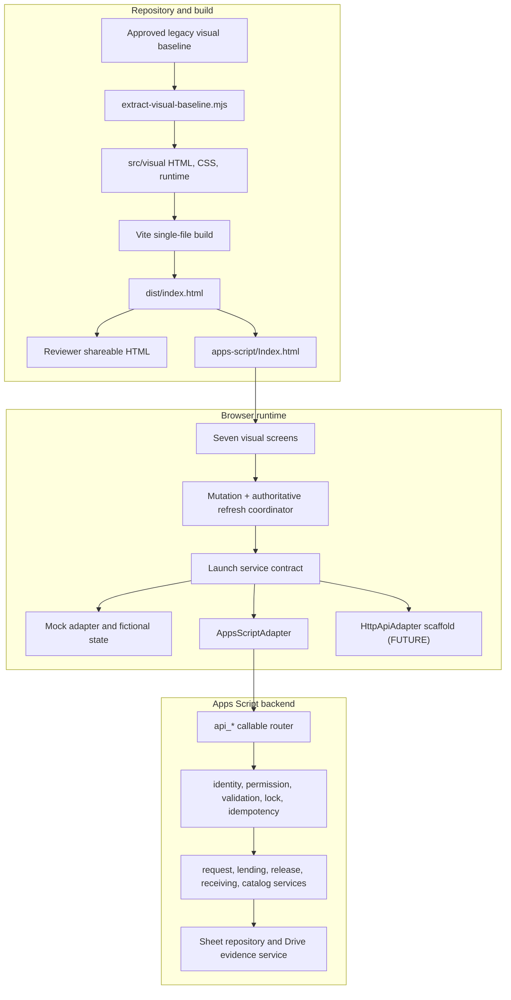
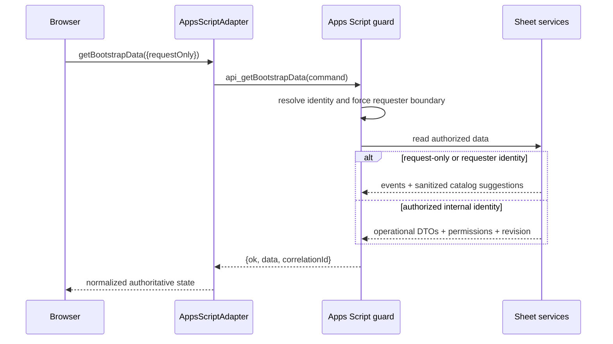
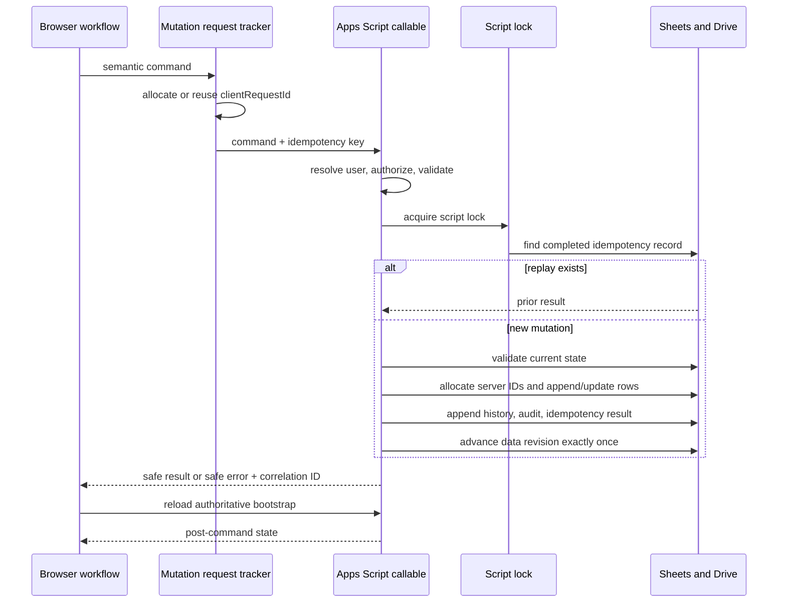
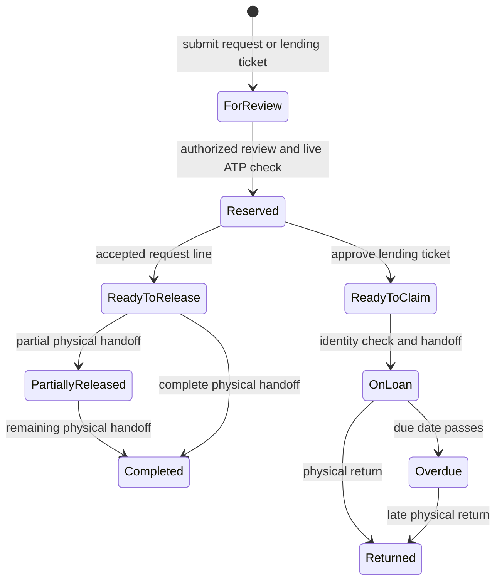
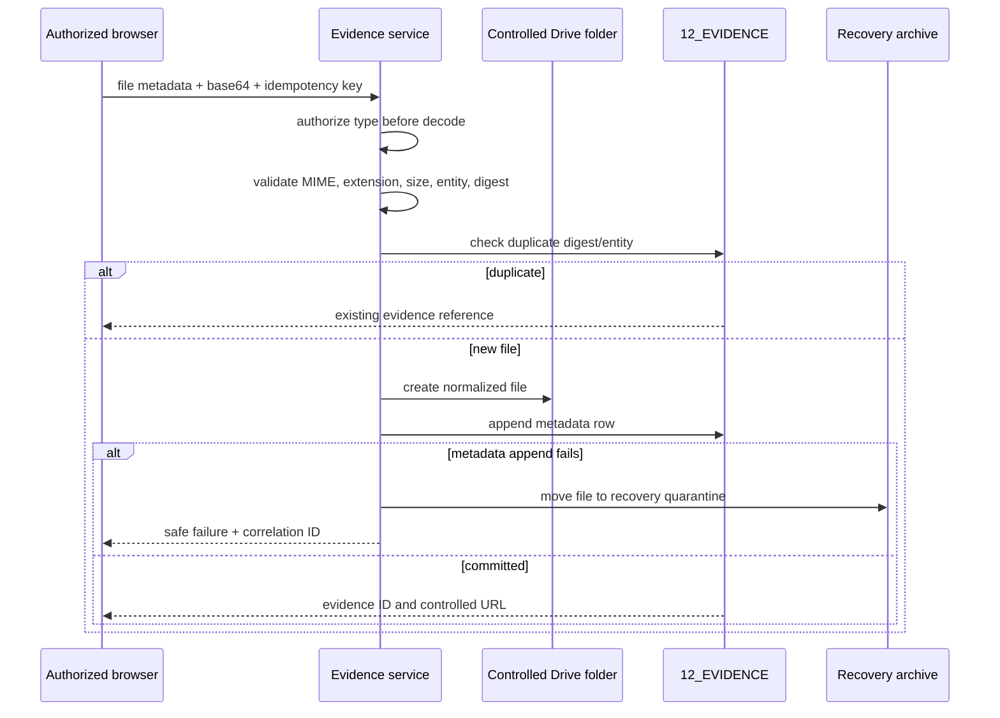
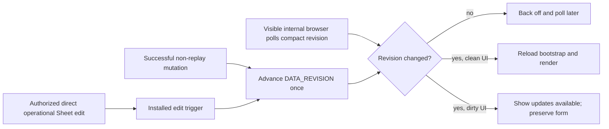
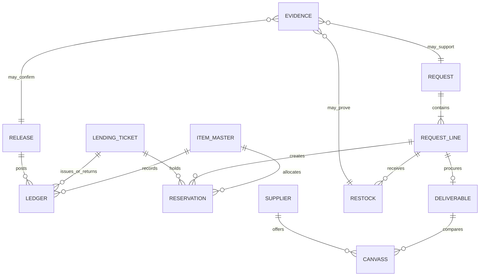
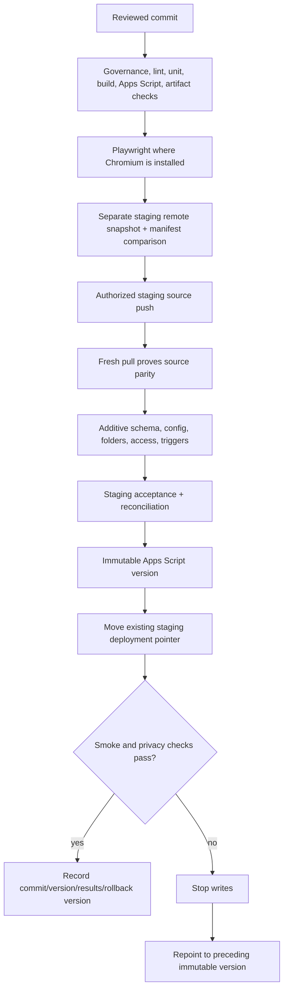
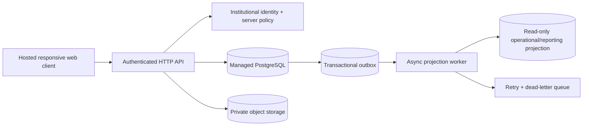

# Full-Stack Architecture

## Scope and truth labels

The system supports HAU University Student Council Department of Logistics request intake, inventory control, lending, release, restocking, procurement, evidence, and audit workflows. The repository currently contains two execution modes:

- **DEMO:** a deterministic, fictional in-browser data set for visual review. It can persist preview state locally but has no real identity or institutional record authority.
- **CURRENT:** a Vite-built single-file browser application connected through an adapter to Google Apps Script, operational Google Sheets, and controlled Google Drive folders. Source presence does not prove a live deployment; see [Operations and Deployment Runbook](OPERATIONS_AND_DEPLOYMENT_RUNBOOK.md).
- **FUTURE:** a proposed hosted web/API/PostgreSQL platform. It is not implemented or deployed; see [Future Hosting and Database](FUTURE_HOSTING_AND_DATABASE.md).

The visual baseline in `legacy/HAU-USC_Logistics-Prototype.original.html` is immutable. `npm run extract:visual` regenerates the authoritative `src/visual/` fragments. Vite injects those fragments through `scripts/authoritative-visual-plugin.mjs`; generated HTML must never be hand-edited.

The current Apps Script deployment record is staging Version 13 and production Version 3 through existing deployment pointers. Both serve the reviewed package and passed bounded read-only portal smoke. Full operational mutation acceptance remains a separate release gate.

## Users and responsibilities

| User                              | Primary need                                             | Current authority boundary                                                                                                   |
| --------------------------------- | -------------------------------------------------------- | ---------------------------------------------------------------------------------------------------------------------------- |
| Public or institutional requester | Submit an event or restock request                       | Sanitized request-only bootstrap and request submission; no internal balances, users, suppliers, evidence internals, or logs |
| DOL staff                         | Review, reserve, release, receive, and lend              | Server-enforced `Can_Review`, `Can_Release`, and `Can_Receive` checks                                                        |
| Committee head                    | Review and receive assigned work                         | Server-enforced role defaults plus per-user flags                                                                            |
| DOL director                      | Operational oversight and catalog administration         | Review, release, receive, admin, and catalog permissions                                                                     |
| Administrator                     | Configuration, migration, backup, access, reconciliation | Server-enforced admin permission; no browser-only grant is authoritative                                                     |
| Read-only auditor                 | Inspect approved records and evidence index              | No default mutation permission; export and audit access must be explicitly approved                                          |

## Current system context

Trust boundaries are crossed at the browser, Apps Script callable, Google identity, operational spreadsheet, Drive, and backup spreadsheet. Every browser field is untrusted. A hidden button, query parameter, role selector, or cached payload is not authorization.

## Current containers and source ownership

`src/visual/runtime.js` and its extension are the active UI runtime. `src/app/`, `src/components/`, and `src/features/` contain modular application work, but the authoritative visual plugin—not those modules—defines the current built screen shell. Any convergence of those trees is a separate reviewed milestone.

Only the active Apps Script adapter may bridge the launch runtime to `google.script.run`. Screens call semantic service methods and do not access Sheets, Drive, or Apps Script globals directly. `HttpApiAdapter` proves that the browser boundary can support a future server API, but it is a scaffold without deployed route parity.

## Read and mutation sequences

### Bootstrap and request-only sanitation

The server forces public and requester identities through the sanitized branch even if the browser asks for internal data. Exact stock, reservations, users, permission flags, suppliers, tax information, borrower history, evidence internals, audit/error logs, configuration, health details, and migration records never belong in the request-only payload.

### Locked idempotent mutation

The browser keeps a stable idempotency key for a retryable failure. A successful command followed by a failed refresh is not resubmitted: the UI warns that the action may already be recorded and offers a read-only refresh.

### Reservation, release, lending, and return

Stock changes only when a posted ledger movement is appended. Reservations reduce available-to-promise but do not change on-hand. A release or lending handoff consumes the applicable reservation and appends an outbound movement. A return appends a new inbound movement; it never edits the original issue. `VERIFY`, inactive, or archived items fail closed.

### Evidence upload and compensation

Drive contains bytes; the Sheet contains searchable metadata. Folder IDs are configuration, not documentation. Filenames exclude borrower names, emails, student IDs, contacts, and supplier tax numbers.

### Revision synchronization

Apps Script HTML Service has no application WebSocket here. Internal browsers use one compact five-second poll while visible and online, immediate checks on focus/reconnect, backoff after failures, and a dirty-form gate. Request-only mode receives no revision fields and does not start polling.

## Current data architecture

This is a logical model over tabs, not a claim of database foreign keys. Sheets provides range writes and a global script lock, not general ACID transactions. The application therefore uses server-generated IDs, state revalidation, append-only quantity/history records, idempotency, bounded batch writes, reconciliation, and launch backups. Exact tabs and authority rules are in [Google Sheets Schema](GOOGLE_SHEETS_SCHEMA.md) and [Data Dictionary](DATA_DICTIONARY.md).

## Screen contract matrix

| Screen                     | Audience and data                                                                              | Primary actions                                                                       | Server permissions                                                                                        | Expected failure handling                                                                                                       | Coverage anchors                                                           |
| -------------------------- | ---------------------------------------------------------------------------------------------- | ------------------------------------------------------------------------------------- | --------------------------------------------------------------------------------------------------------- | ------------------------------------------------------------------------------------------------------------------------------- | -------------------------------------------------------------------------- |
| Operations Overview        | Internal staff; derived request, lending, stock, evidence, and milestone summaries             | Navigate to queues and exceptions                                                     | Authorized internal bootstrap                                                                             | Empty states; revision banner; safe bootstrap error                                                                             | render/domain tests; responsive navigation; staging bootstrap smoke        |
| Request Center             | Public/requester sanitized event and catalog data; internal review queue for authorized users  | Compose lines, submit, review/route                                                   | Submit uses requester boundary; review requires `Can_Review`                                              | Exact-item selection required for stock route; validation remains local until server confirms; no internal data in request mode | request workflow, privacy, keyboard/accessibility, idempotent submit       |
| Office Lending Hub         | Internal catalog availability, eligibility, tickets, borrower workflow                         | Create, approve, hand off, return, emergency issue                                    | Review for create/approve; release for handoff/return; emergency path is privileged                       | Block VERIFY/inactive/ineligible/out-of-stock/over-limit items; preserve correlation ID                                         | lending policy, catalog sync, lifecycle, retry/replay                      |
| Release Desk               | Accepted request lines, reservations, recipient confirmation, evidence                         | Confirm partial or full physical release                                              | `Can_Release`                                                                                             | Recheck reservation and current state; one append-only movement; never retry after recorded/refresh warning                     | release unit/domain tests; staging partial/full handoff                    |
| Restocking                 | Restock request lines, cumulative receipts, supplier/evidence context                          | Receive one line at a time                                                            | `Can_Receive`                                                                                             | Reject excess/invalid receipt; siblings remain untouched; evidence failure is visible                                           | restock cumulative receipt and idempotency tests                           |
| Procurement & Deliverables | Deliverables, canvass references, suppliers, budget/procurement states                         | Save/select canvass, transition, receive, transfer event item                         | Review/receive/admin depending command                                                                    | Validate transition and selected entity; semantic confirmation for merge; no silent status jump                                 | procurement transition, canvass, transfer, receiving tests                 |
| Inventory Management       | Internal item metadata, ledger-derived balances, reservations, provenance, catalog permissions | Search, inspect ledger, create/update/storage/archive/restore, cycle-count adjustment | Read requires review or catalog access; metadata requires `Can_Manage_Catalog`; adjustments require admin | Quantity and provenance fields cannot be edited as metadata; dependencies protect unit/archive; VERIFY fails closed             | inventory calculations, catalog authorization, responsive table/card tests |

The reports/admin modules under `src/features/` are not an eighth authoritative visual screen in the current build. Administrative functions are Apps Script operator callables and documented in [Administrator Guide](ADMIN_GUIDE.md).

## Build, release, and rollback flow

A source push is not a deployment, an exit code is not parity, and a new Apps Script version is not proof that the reviewed files were uploaded. Complete evidence and rollback gates are in [Operations and Deployment Runbook](OPERATIONS_AND_DEPLOYMENT_RUNBOOK.md).

## Future target and compatibility boundary

In the proposed target, PostgreSQL becomes the only command-side authority. Each business transaction and its outbox event commit atomically. A worker projects approved reporting rows to Sheets asynchronously with idempotent event keys, checkpoints, retries, and a dead-letter queue. Sheets never participates in the request transaction and is never dual-written by browser code. Object storage is private; short-lived signed access is issued only after authorization. The current service method names are the compatibility seam, but route semantics, identity, migrations, and parity require an implementation milestone before cutover.

## Non-negotiable invariants

1. Posted ledger entries, status history, and audit records are append-only. Corrections are explicit reversals or adjustments.
2. `VERIFY` items retain exact legacy source coordinates, name, quantity, and unit and cannot transact.
3. IDs are server-generated and row numbers are never identities.
4. Every state-changing command is authorized, validated, locked where state can race, idempotent, audited, and correlated.
5. Operational and backup spreadsheets are different resources; the backup is never a write target for routine workflows.
6. Missing Drive configuration fails closed and never falls back to the script owner's root.
7. Request-only payloads are sanitized on the server. UI visibility is convenience, not security.
8. Demo, current source, staging, production, and future design are always described separately.
