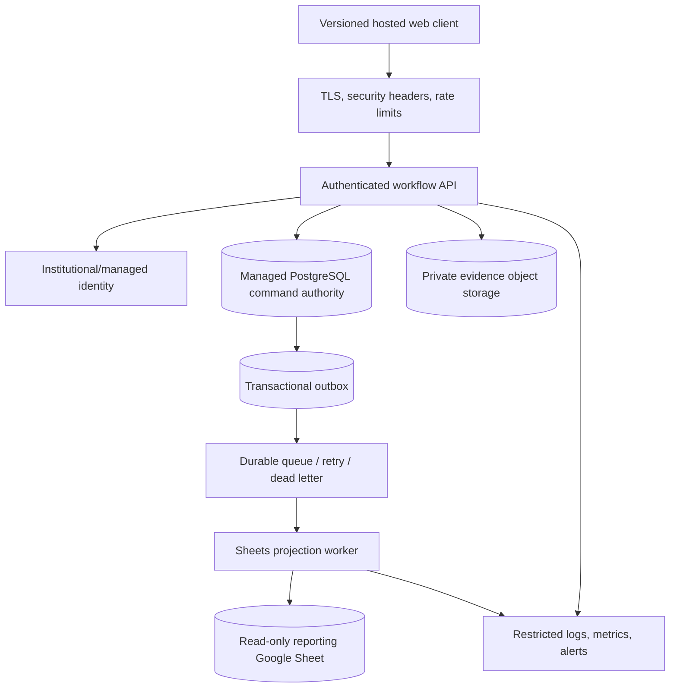
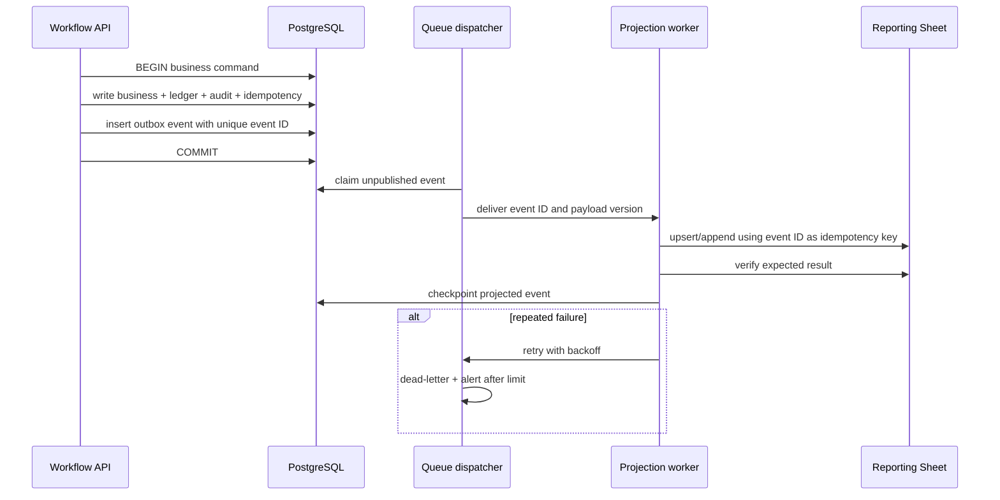

# Future Hosting and Database

## Status

Everything in this document is **FUTURE / PROPOSED**. The repository has an `HttpApiAdapter` scaffold, but no hosted API, managed PostgreSQL schema, hosted identity, object-storage migration, queue, infrastructure-as-code, or production cutover. The current Apps Script pilot must not be described as already migrated.

The provider comparison dated 2026-07-13 is in [Hosting and Database Candidates](HOSTING_AND_DATABASE_CANDIDATES.md). [ADR 0001](adr/0001-future-hosted-platform.md) proposes Cloudflare plus Supabase, with a Google-native runner-up; the decision remains reversible pending a two-stack validation spike and institutional review.

## Target boundaries

PostgreSQL is the only command-side source of truth after cutover. The browser never talks directly to the database, storage service role, queue, or Sheets API. The API returns client-safe DTOs and signed/streamed evidence access only after authorization. Google Sheets is an asynchronous reporting projection and never a fallback write path.

## Compatibility contract

The existing semantic browser methods remain the migration seam: bootstrap/current user/revision/search, request review/reservation/release, lending, procurement/receiving/transfer, evidence, audit timeline, and catalog management. The future server may expose `POST /api/{method}` initially, but route shape is less important than preserving:

- server-owned identity and permission checks;
- exact request-only DTO exclusions;
- idempotency key behavior and safe replay result;
- transaction/locking equivalent for race-prone state;
- server-generated IDs and authoritative post-command refresh;
- append-only ledger/history/audit and explicit correction;
- stable safe error code, correlation ID, and retry guidance;
- one revision/change token for client synchronization.

Before any browser switches adapter, add contract tests that run identical success/failure/replay/privacy cases against the mock, Apps Script staging, and hosted staging implementations.

## Relational command model

Use internal UUID primary keys with unique human-readable display IDs. Enforce foreign keys, positive/check constraints, status transition policy, unique idempotency, and append-only protection. The complete Sheet-to-relation map is in [Data Dictionary](DATA_DICTIONARY.md).

Core aggregates are:

- item + aliases + immutable legacy provenance;
- inventory ledger entries and reservations;
- request + request lines;
- lending ticket lifecycle;
- release + normalized release lines;
- restock and deliverable receipts;
- suppliers and canvass/price observations;
- private evidence objects and entity links;
- users/roles/grants tied to identity-provider subject;
- status history, audit log, idempotency record, migration run/mapping;
- transactional outbox and projection checkpoint/dead letter.

One command transaction includes every business row, ledger entry, status history, audit entry, idempotency result, revision/change event, and outbox event required by that command. If any required write fails, the transaction rolls back. Evidence bytes require a staged-object/finalize or compensation design because object storage is outside the database transaction.

## Transactional outbox to Sheets

The dispatcher must use safe concurrent claiming, a lease/attempt counter, and at-least-once delivery. The projection must therefore be idempotent. Store event schema version, aggregate ID/version, occurred time, and correlation ID; exclude personal fields that the reporting Sheet does not need. Monitor oldest unprojected age, retry/dead-letter count, checkpoint drift, and daily source/projection reconciliation.

Projection outage does not block PostgreSQL commands unless an approved maximum-lag safety rule is reached. Database outage stops new commands. There is never direct browser-to-Sheets write or synchronous database-plus-Sheets dual commit.

## Evidence storage

Use a private bucket with opaque keys, checksum, size/type metadata, encryption, lifecycle, access audit, and independent backup/export. An upload flow should issue a tightly scoped short-lived upload authorization or proxy bytes through the API, finalize only after server checksum/type/entity validation, then commit evidence metadata and audit. Download authorization is evaluated each time; URLs are short-lived bearer capabilities and remain out of logs/referrers.

Migrate Drive evidence by inventorying metadata, copying one object, verifying digest/size/type, recording new key plus old restricted provenance, and reconciling counts. Do not delete or alter Drive during the rollback window.

## Identity and authorization

Map an institutional identity-provider subject to a user record; do not key authorization solely by mutable email. Require MFA/account recovery under institutional policy, short sessions, explicit active/grant state, and immediate offboarding. Server policy remains the authority. Database row-level security narrows requester/read paths but cannot replace server command authorization; service credentials bypassing RLS are never sent to browsers.

Preview deployments must be protected and use isolated databases/buckets/identity audiences. Never connect a pull-request preview to production records.

## Migration phases and gates

### Phase 0: governance and two-stack spike

Approve data classification, retention, incident/owner model, RPO/RTO, budget, region, identity, vendor terms, and exit requirements. Run the preferred/runner-up validation slice from the candidate document, including Philippine-network measurements and restore/export. No production data migration.

**Rollback:** delete isolated fictional spike resources after retaining sanitized results; current Apps Script remains unchanged.

### Phase 1: contract and infrastructure foundation

Version the HTTP contract and errors; create infrastructure-as-code for dev/staging/prod separation, identity, PostgreSQL, private storage, queue, secrets, logs, budgets, and backups. Implement all contract tests with fictional data.

**Gate:** security review, no direct browser credentials, restore/exit drill, protected previews, full adapter parity.

**Rollback:** keep browser on Apps Script adapter; destroy/recreate future staging from code.

### Phase 2: read-only import rehearsal

Export a privately approved staging copy, transform into PostgreSQL, preserve display IDs/provenance, copy sample evidence, and reconcile every count/balance/link/digest. Serve a restricted hosted read-only UI for comparison.

**Gate:** repeated deterministic migration, zero unexplained differences, performance/authorization/privacy acceptance.

**Rollback:** discard future staging data; Apps Script remains operational authority.

### Phase 3: hosted command staging and Sheets projection

Enable full commands against future staging only. Exercise concurrency, idempotency, object compensation, outbox retries/dead letter, projection lag/reconciliation, backups/PITR, alerts, and deployment rollback. Sheets projection uses a dedicated reporting workbook, not the current operational Sheet.

**Gate:** complete acceptance and restore/rollback drill at expected pilot load.

**Rollback:** disable hosted staging writes; retain evidence for diagnosis; no production impact.

### Phase 4: production cutover rehearsal

Freeze a production-like snapshot and rehearse timed export/import/reconciliation, identity/grants, DNS/deployment, object copy, job checkpoints, smoke, and reverse decision before the agreed downtime/RPO expires.

**Gate:** owner signs cutover and reverse-cutover criteria; no unresolved VERIFY, privacy, balance, or evidence mismatch.

### Phase 5: bounded production cutover

Announce a write freeze in the Apps Script system, take a fresh backup/export, migrate and reconcile, mark the old system read-only, enable hosted API for a limited audience, then expand only after critical monitoring. PostgreSQL becomes authority at one explicit cutover instant. Do not dual-write commands to both databases.

**Rollback window:** stop hosted writes, reconcile all hosted commands since cutover, export/apply them to the prior system only through an approved audited forward-import procedure, restore the Apps Script deployment/write path, and keep future objects/database read-only for investigation. If safe reverse import cannot be proven within the window, remain stopped and invoke the incident/data-owner decision; never choose a source of truth silently.

### Phase 6: stabilization and decommission

After the approved observation/retention window and restore audits, remove Apps Script write capability, retain legacy Sheets/Drive as governed read-only archives, rotate old credentials, and update runbooks. Decommission only after legal/records/privacy and data-owner approval.

## Cutover reconciliation minimum

- entity counts and unique display IDs;
- item opening balances, posted ledger sums, active reservations, ATP, event balances;
- request/line statuses and cumulative release/receipt totals;
- lending lifecycle and due/return state;
- supplier/canvass links with restricted fields protected;
- evidence count, size, digest, entity links, and missing/quarantine status;
- status/audit/idempotency/correlation continuity;
- user identity/grant parity and unauthorized tests;
- outbox/projection zero unexplained lag at the cutover boundary;
- backup/PITR and export restore proof.

## Conditions that reverse the proposed provider decision

Choose or prefer the Google-native runner-up if HAU mandates one Google control plane, requires Cloud SQL HA/DR features, prohibits the cross-vendor data path, or already has governed billing/IAM/support that materially lowers operations risk. Re-open all candidates if the preferred stack cannot meet identity, RPO/RTO, private evidence, Philippines measurements, predictable budget, institutional contract, or tested exit requirements.
