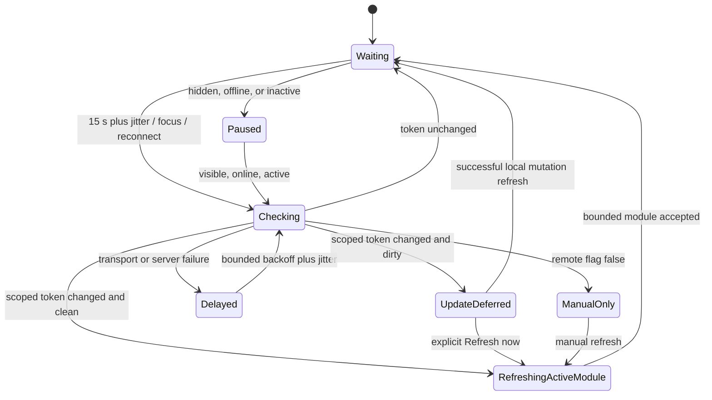

# Slice 12 Near-Live Refresh Evidence

## State model

Only `RefreshingActiveModule` may call `api_getBootstrapModule`. Scheduled
checks never call essential or legacy full bootstrap, and no refresh path replays
a write.

## Deterministic request/read model

The accepted cadence is 15 seconds, so a continuously eligible session has an
upper bound of 240 revision requests per hour before visibility, activity,
offline, backoff, and jitter reductions.

| Active sessions | Revision requests/hour | Revision metadata reads/hour | Module requests when unchanged | Conditional average concurrency at 2 s p95 |
|---:|---:|---:|---:|---:|
| 1 | 240 | 240 | 0 | 0.13 |
| 10 expected model | 2,400 | 2,400 | 0 | 1.33 |
| 30 peak model | 7,200 | 7,200 | 0 | 4.00 |

Each remote change adds at most one active-module request per eligible session.
Two changes during an hour therefore model 60 additional module requests at the
30-session peak, for 7,260 total browser-to-server requests. The unit test
`revision polling controller > normalizes revisions and uses bounded
exponential backoff` asserts these exact counts.

The four-execution conditional average is 99.6% below the documented
1,000-simultaneous-executions-per-script ceiling. It is not a live result. The
30-per-user ceiling has no safe margin if one person opens 30 simultaneously
active tabs, so that pattern is explicitly outside the accepted operating model
and remains a Slice 13 staging test.

## Fake-timer and safety proof

The revision-controller suite proves:

- 15,000 / 30,000 / 60,000 / 120,000 ms bounded backoff;
- 13,500 / 15,000 / 16,500 ms jitter bounds at deterministic random values;
- a maximum of one in-flight call;
- hidden, offline, and inactive checks do not start;
- a scope change makes a late response ineligible for acceptance;
- closing an abandoned modal draft removes its stale dirty marker before the
  next scoped decision;
- a disabled response stops automatic scheduling while a manual recheck can
  observe re-enablement;
- response metrics accumulate only safe integer request/read counts.

The Apps Script VM suite proves authorization, invalid-scope denial, fail-closed
flag behavior, exactly-once global mutation revision, affected-scope token
mapping, all-scope conservative fallback, and selected-scope-only increments.

## Synthetic browser network trace

The assembled Apps Script browser workflow records every adapter call and
asserts the following trace:

| Scenario | Scoped revision calls | Module calls | Essential/full-bootstrap calls | Writes |
|---|---:|---:|---:|---:|
| Unchanged focus check | 1 | 0 | 0 | 0 |
| Changed clean active `lending` scope | 1 | 1 (`lending`) | 0 | 0 |
| Changed dirty scope | 1 | 0 | 0 | 0 |
| Manual refresh after remote disable | 0 | 1 (active module) | 0 | 0 |
| Ambiguous post-write refresh failure and retry | 0 | 2 attempts | 0 | exactly 1 |

The same workflow asserts that dirty borrower input remains unchanged, shows
Updates available, and that the disabled state reads Manual refresh only. The
final Playwright HTML report attaches `near-live-dirty-deferral` and
`near-live-remote-disable` screenshots from the 390 px assembled Apps Script
run.

## Current official limit preflight

Checked 2026-07-16:

- <https://developers.google.com/apps-script/guides/services/quotas>
- <https://developers.google.com/apps-script/guides/html/communication>
- <https://developers.google.com/apps-script/guides/html/reference/run>
- <https://developers.google.com/apps-script/guides/support/best-practices>

The documented ceilings remain six minutes per execution, 30 simultaneous
executions per user, 1,000 per script, and ten concurrent `google.script.run`
calls per page. The repository design uses one call at a time and treats all
limits as mutable ceilings rather than targets.

## Unrun live evidence

Repository tests do not prove Apps Script/Sheets latency, live p95 visibility,
real institutional concurrency, direct-edit trigger latency, or quota behavior.
Those remain explicit Slice 13 staging gates requiring authorized resources,
synthetic/redacted data, named testers, and owner acceptance. No external Google
resource was read or changed in Slice 12.
